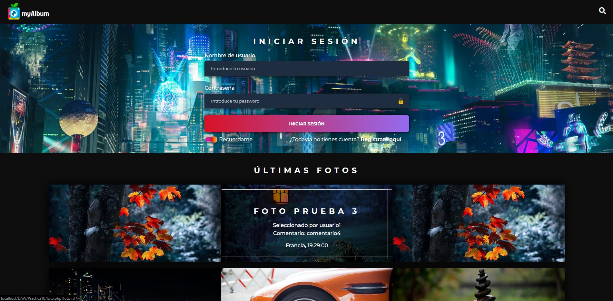
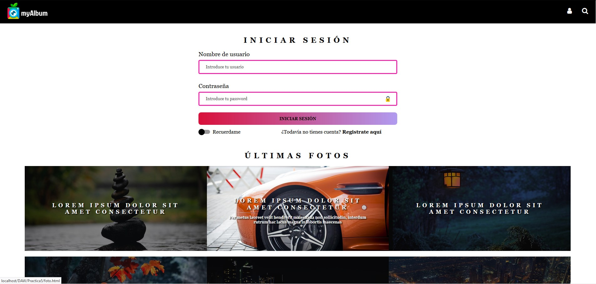
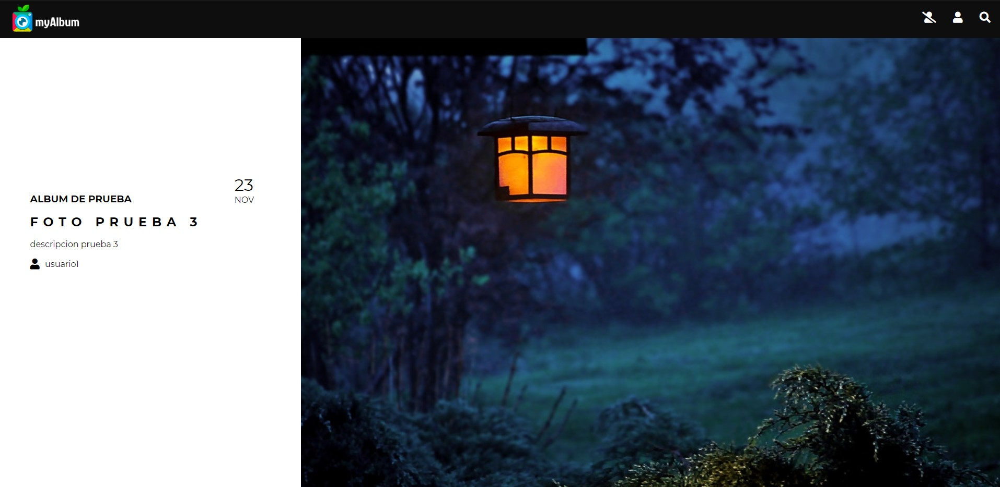

 

Project made in second year of **Multimedia engineering**. In this project we make use of some programming languages as *PHP* for the back-end and *HTML & CSS* for the front-end.

In this project I made focus about the usability and accesibility in the web. In the following pictures we can see the differences between the standard web and one version more focused in usability and accesibility.

Web             |  Accessible web
:-------------------------:|:-------------------------:
  |  

And finally there are some pics of the web page like sign up and photo preview

Photo preview             |  Sign Up
:-------------------------:|:-------------------------:
  |  